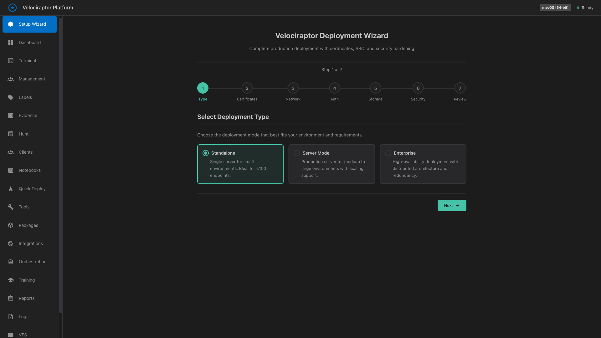
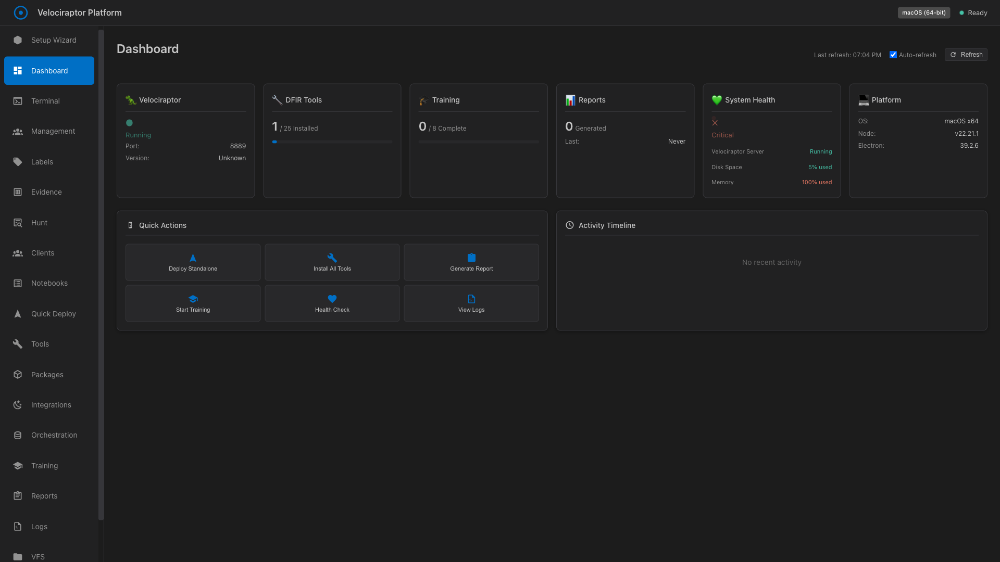
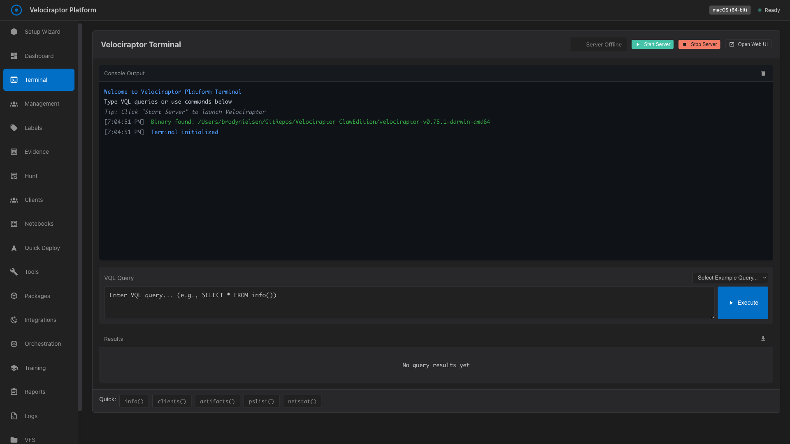
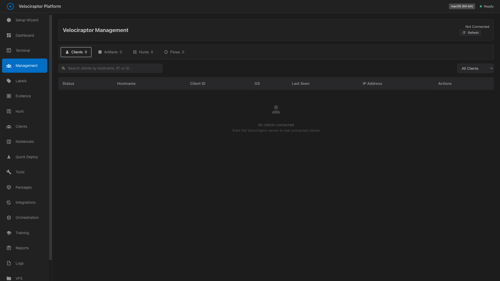
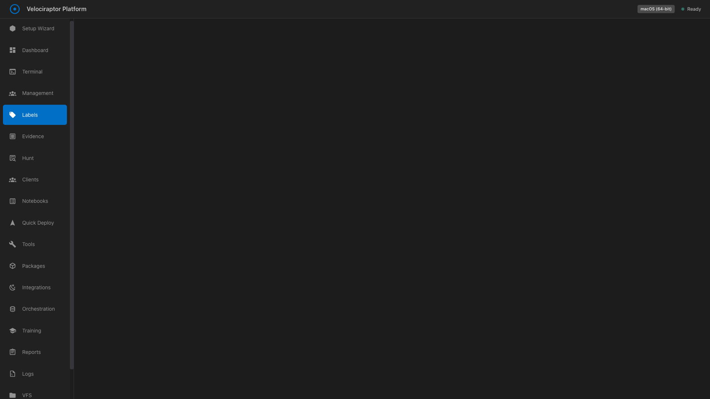
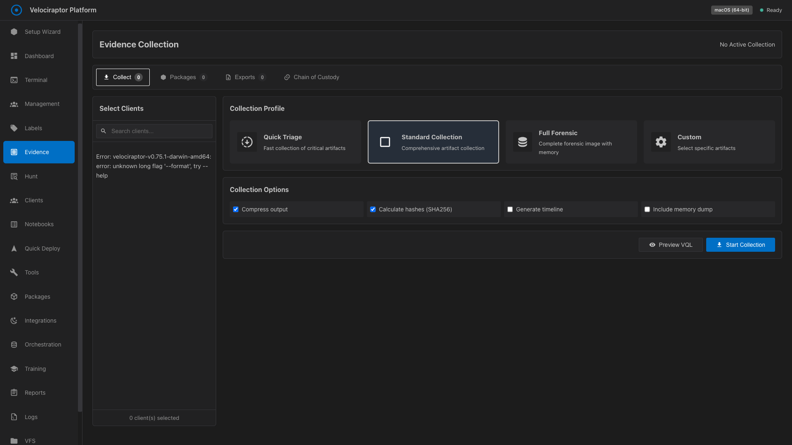
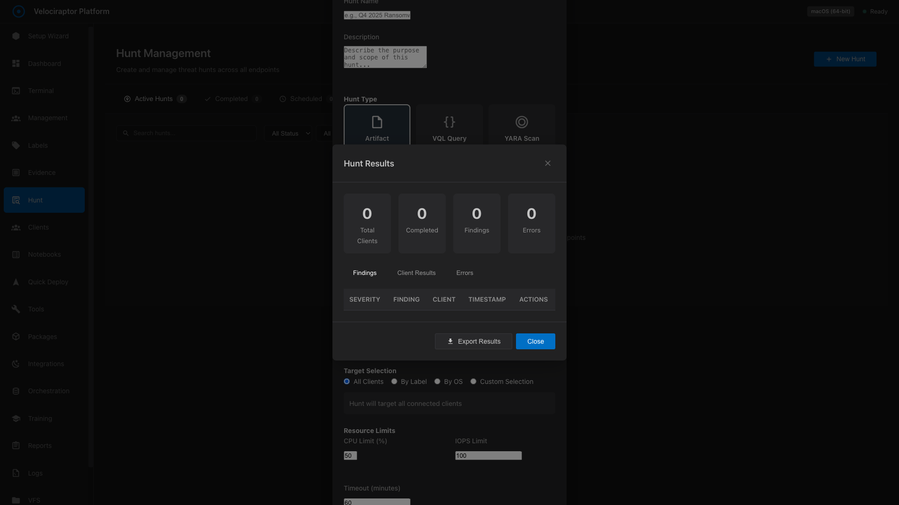

# Velociraptor Platform Electron - Design Reference

Captured: 2026-02-06T02:05:43.605Z

## Overview

This document provides a visual reference of the Velociraptor Platform Electron app's UI for porting to macOS SwiftUI.

- **Total Views**: 19
- **Successfully Captured**: 7
- **Failed**: 12

## Screenshots

| Tab | Status | Description |
|-----|--------|-------------|
| 01-Setup-Wizard | ✅ | Initial setup and configuration wizard |
| 02-Dashboard | ✅ | System overview, status cards, activity timeline |
| 03-Terminal | ✅ | Integrated terminal for Velociraptor CLI |
| 04-Management | ✅ | Client management, hunts, flows |
| 05-Labels | ✅ | Client labeling system |
| 06-Evidence | ✅ | Evidence collection and chain of custody |
| 07-Hunt | ✅ | Threat hunting interface |
| 08-Clients | ❌ | locator.click: Timeout 30000ms exceeded.
Call log:
  - waiting for locator('[data-tab="clients"]')
    - locator resolved to <li class="nav-item" data-tab="clients">…</li>
  - attempting click action
    2 × waiting for element to be visible, enabled and stable
      - element is visible, enabled and stable
      - scrolling into view if needed
      - done scrolling
      - 
…
 from <main class="content">…</main> subtree intercepts pointer events
    - retrying click action
    - waiting 20ms
    2 × waiting for element to be visible, enabled and stable
      - element is visible, enabled and stable
      - scrolling into view if needed
      - done scrolling
      - 
…
 from <main class="content">…</main> subtree intercepts pointer events
    - retrying click action
      - waiting 100ms
    54 × waiting for element to be visible, enabled and stable
       - element is visible, enabled and stable
       - scrolling into view if needed
       - done scrolling
       - 
…
 from <main class="content">…</main> subtree intercepts pointer events
     - retrying click action
       - waiting 500ms
    - waiting for element to be visible, enabled and stable
 |
| 09-Notebooks | ❌ | locator.click: Target page, context or browser has been closed
Call log:
  - waiting for locator('[data-tab="notebooks"]')
    - locator resolved to <li class="nav-item" data-tab="notebooks">…</li>
  - attempting click action
    2 × waiting for element to be visible, enabled and stable
      - element is visible, enabled and stable
      - scrolling into view if needed
      - done scrolling
      - 
…
 from <main class="content">…</main> subtree intercepts pointer events
    - retrying click action
    - waiting 20ms
    2 × waiting for element to be visible, enabled and stable
      - element is visible, enabled and stable
      - scrolling into view if needed
      - done scrolling
      - 
…
 from <main class="content">…</main> subtree intercepts pointer events
    - retrying click action
      - waiting 100ms
    15 × waiting for element to be visible, enabled and stable
       - element is visible, enabled and stable
       - scrolling into view if needed
       - done scrolling
       - 
…
 from <main class="content">…</main> subtree intercepts pointer events
     - retrying click action
       - waiting 500ms
 |
| 10-Quick-Deploy | ❌ | locator.count: Target page, context or browser has been closed |
| 11-Tools | ❌ | locator.count: Target page, context or browser has been closed |
| 12-Packages | ❌ | locator.count: Target page, context or browser has been closed |
| 13-Integrations | ❌ | locator.count: Target page, context or browser has been closed |
| 14-Orchestration | ❌ | locator.count: Target page, context or browser has been closed |
| 15-Training | ❌ | locator.count: Target page, context or browser has been closed |
| 16-Reports | ❌ | locator.count: Target page, context or browser has been closed |
| 17-Logs | ❌ | locator.count: Target page, context or browser has been closed |
| 18-VFS | ❌ | locator.count: Target page, context or browser has been closed |
| 19-Settings | ❌ | locator.count: Target page, context or browser has been closed |

## Views Detail

### 01-Setup-Wizard

Initial setup and configuration wizard

---

### 02-Dashboard

System overview, status cards, activity timeline

---

### 03-Terminal

Integrated terminal for Velociraptor CLI

---

### 04-Management

Client management, hunts, flows

---

### 05-Labels

Client labeling system

---

### 06-Evidence

Evidence collection and chain of custody

---

### 07-Hunt

Threat hunting interface

---

## Notes for macOS SwiftUI Implementation

### Design Language
- The Electron app uses a dark theme with cyan/teal accent colors
- Icons are SVG-based, should be converted to SF Symbols where possible
- Layout uses a sidebar navigation pattern (similar to macOS apps)

### Key UI Components to Implement
1. **Sidebar Navigation** - Already implemented in macOS app
2. **Status Cards** - Dashboard widgets showing system status
3. **Terminal Emulator** - Integrated terminal view
4. **Data Tables** - Client lists, hunt results, artifacts
5. **Forms** - Configuration wizards, settings panels
6. **Modals/Dialogs** - Confirmation dialogs, detail views

### Color Palette (Approximate)
- Background: #1a1a2e, #16213e
- Accent: #00d9ff (cyan), #4fd1c5 (teal)
- Success: #48bb78
- Warning: #ed8936
- Error: #f56565
- Text: #e2e8f0 (primary), #a0aec0 (secondary)

### Typography
- Font: System font (segoe UI on Windows, SF Pro on macOS)
- Heading sizes: 24px (h1), 18px (h2), 16px (h3)
- Body: 14px

### Spacing
- Card padding: 16-24px
- Element spacing: 8-16px
- Sidebar width: ~200px
