# Velociraptor Platform Electron - Design Reference

Captured: 2026-02-06T02:07:57.524Z

## Overview

This document provides a visual reference of the Velociraptor Platform Electron app's UI for porting to macOS SwiftUI.

- **Total Views**: 19
- **Successfully Captured**: 19
- **Failed**: 0

## Screenshots

| Tab | Status | Description |
|-----|--------|-------------|
| 01-Setup-Wizard | ✅ | Initial setup and configuration wizard |
| 02-Dashboard | ✅ | System overview, status cards, activity timeline |
| 03-Terminal | ✅ | Integrated terminal for Velociraptor CLI |
| 04-Management | ✅ | Client management, hunts, flows |
| 05-Labels | ✅ | Client labeling system |
| 06-Evidence | ✅ | Evidence collection and chain of custody |
| 07-Hunt | ✅ | Threat hunting interface |
| 08-Clients | ✅ | Endpoint management and monitoring |
| 09-Notebooks | ✅ | VQL notebooks |
| 10-Quick-Deploy | ✅ | Quick deployment interface |
| 11-Tools | ✅ | DFIR tools management (25+ tools) |
| 12-Packages | ✅ | Package management |
| 13-Integrations | ✅ | Third-party integrations |
| 14-Orchestration | ✅ | Automation and playbooks |
| 15-Training | ✅ | 8 incident simulation scenarios |
| 16-Reports | ✅ | Report generation |
| 17-Logs | ✅ | Application logs |
| 18-VFS | ✅ | Virtual File System browser |
| 19-Settings | ✅ | Application configuration |

## Views Detail

### 01-Setup-Wizard

Initial setup and configuration wizard

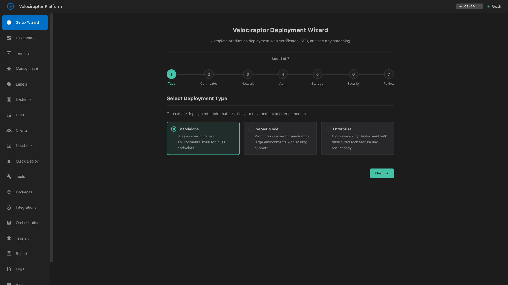

---

### 02-Dashboard

System overview, status cards, activity timeline

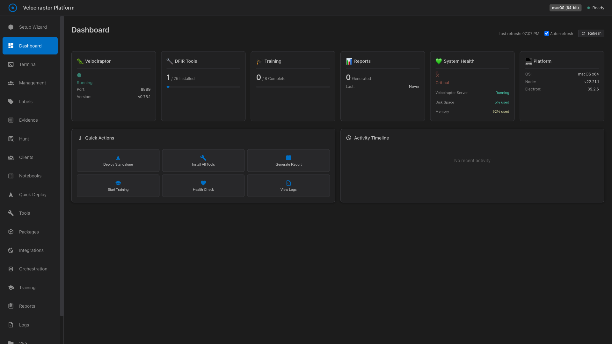

---

### 03-Terminal

Integrated terminal for Velociraptor CLI

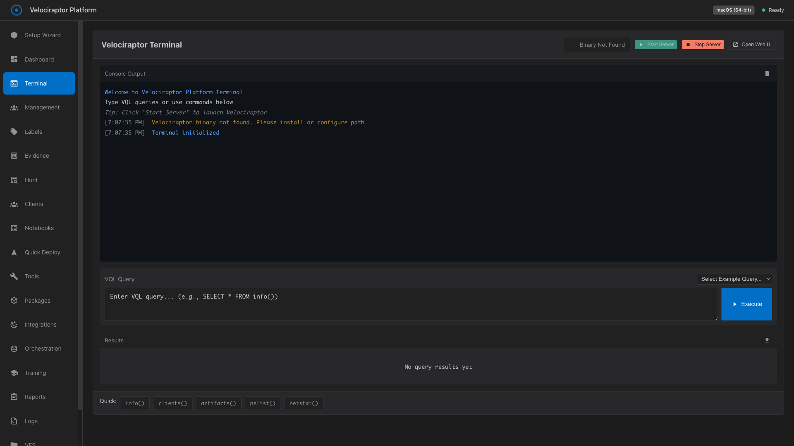

---

### 04-Management

Client management, hunts, flows

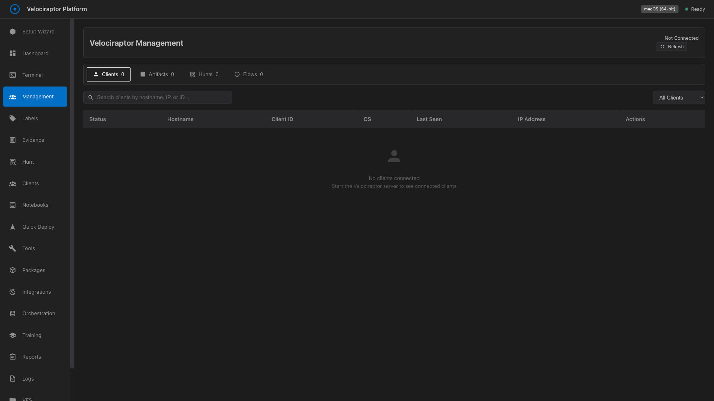

---

### 05-Labels

Client labeling system

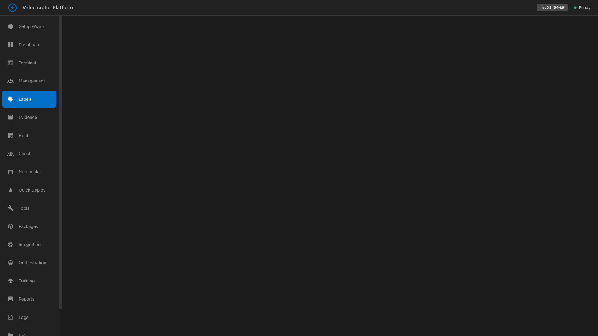

---

### 06-Evidence

Evidence collection and chain of custody

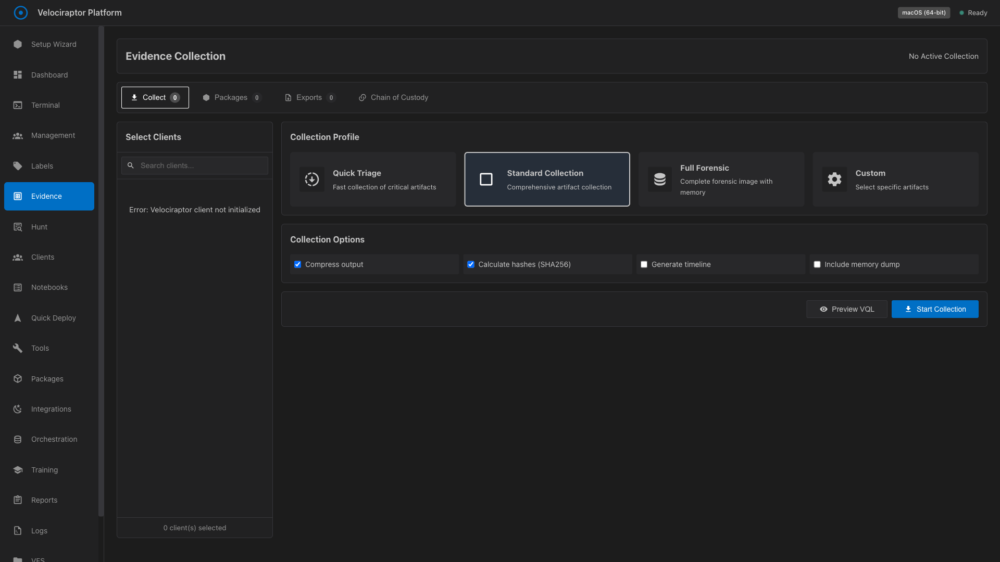

---

### 07-Hunt

Threat hunting interface

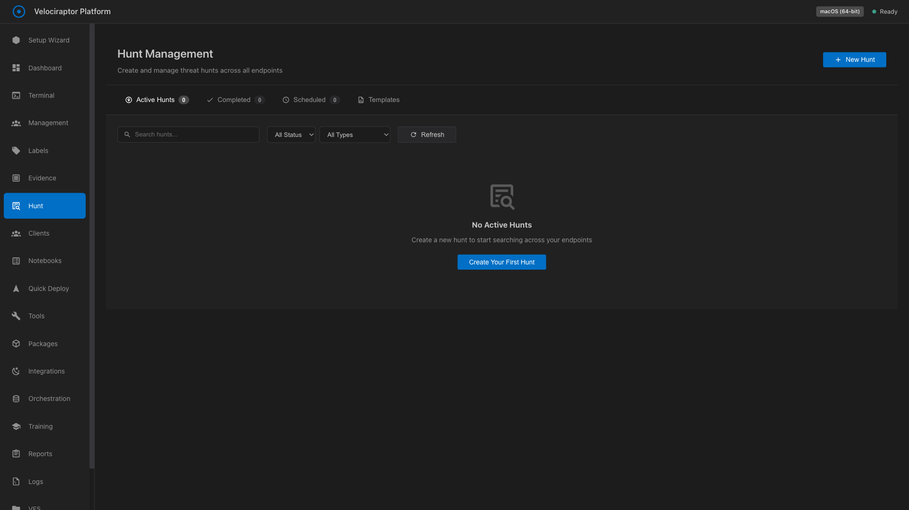

---

### 08-Clients

Endpoint management and monitoring

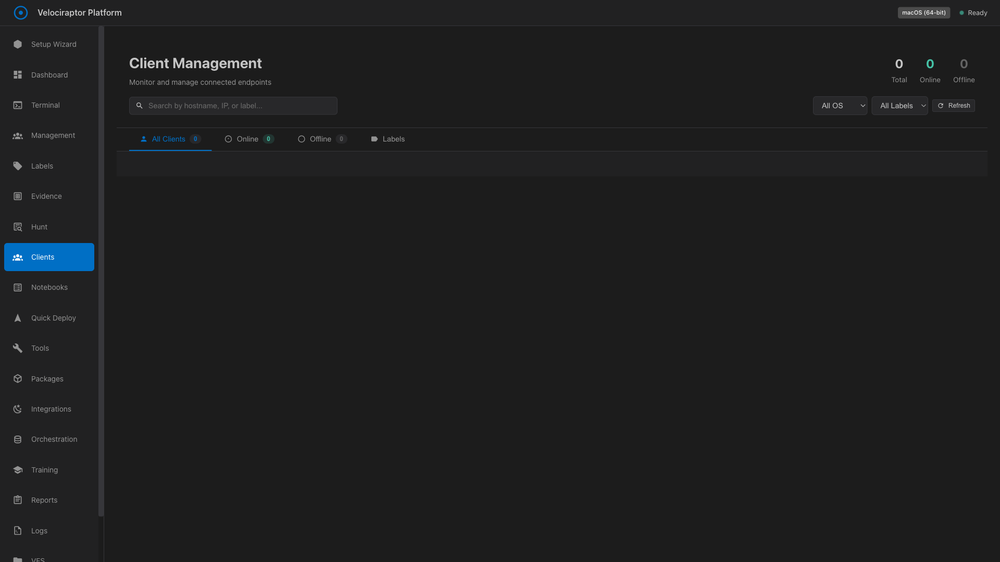

---

### 09-Notebooks

VQL notebooks

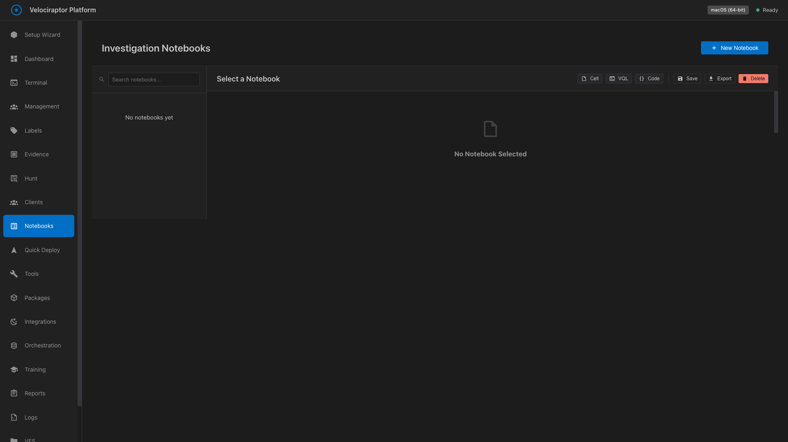

---

### 10-Quick-Deploy

Quick deployment interface

---

### 11-Tools

DFIR tools management (25+ tools)

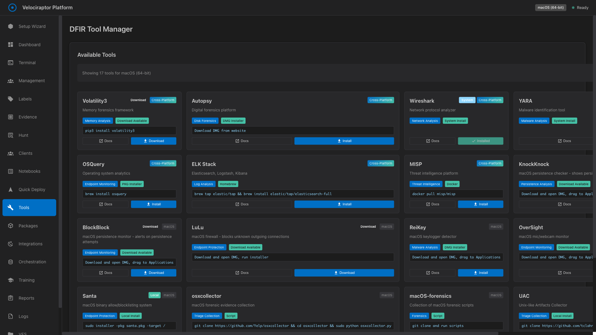

---

### 12-Packages

Package management

---

### 13-Integrations

Third-party integrations

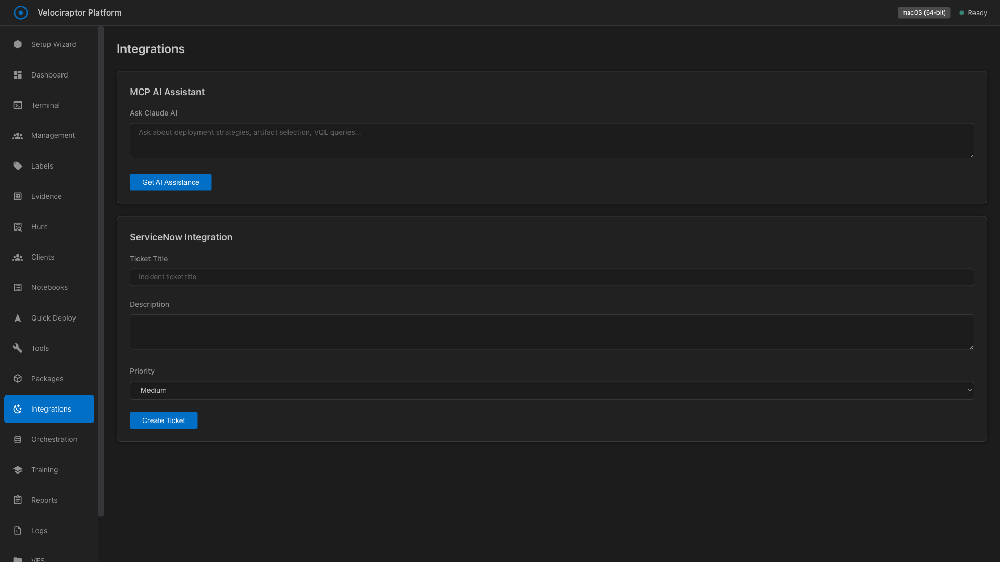

---

### 14-Orchestration

Automation and playbooks

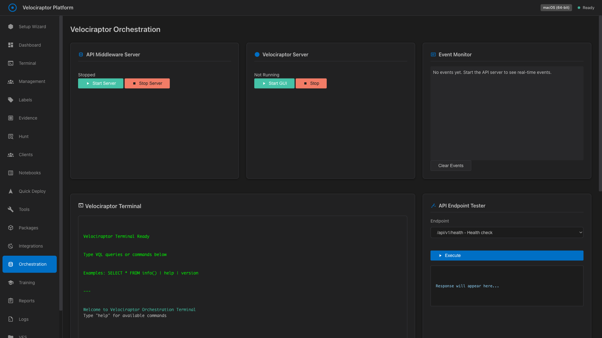

---

### 15-Training

8 incident simulation scenarios

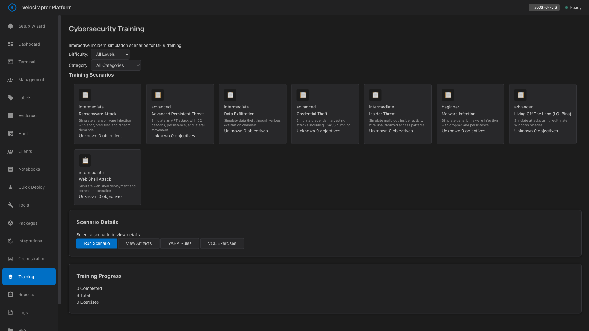

---

### 16-Reports

Report generation

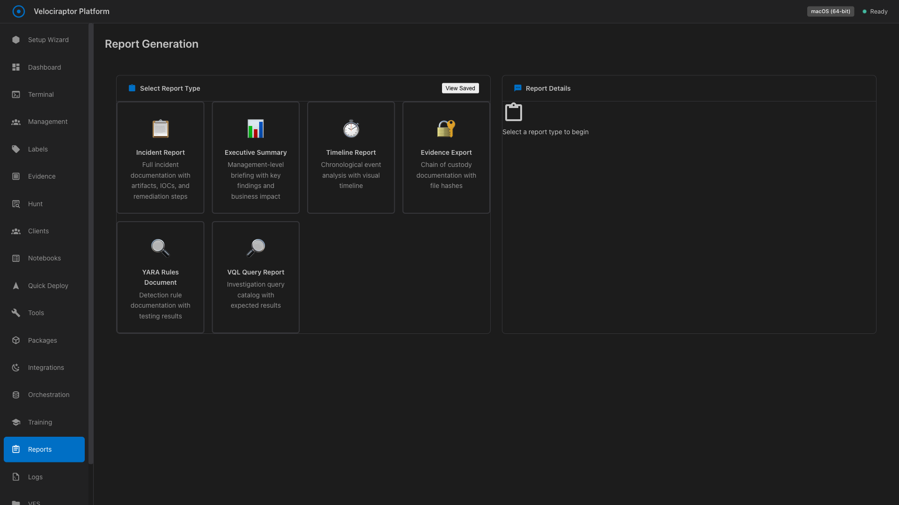

---

### 17-Logs

Application logs

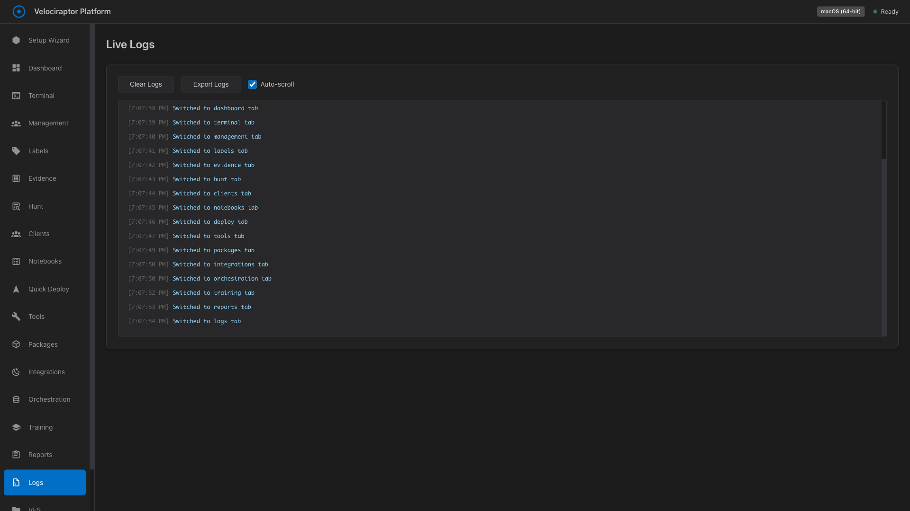

---

### 18-VFS

Virtual File System browser

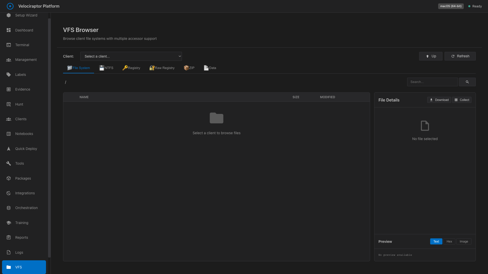

---

### 19-Settings

Application configuration

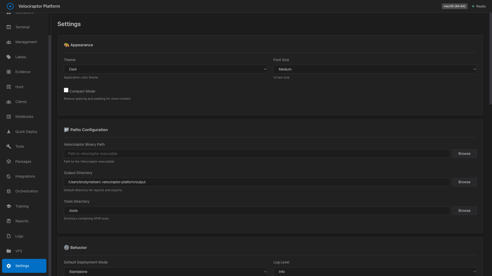

---

## Notes for macOS SwiftUI Implementation

### Design Language
- The Electron app uses a dark theme with cyan/teal accent colors
- Icons are SVG-based, should be converted to SF Symbols where possible
- Layout uses a sidebar navigation pattern (similar to macOS apps)

### Key UI Components to Implement
1. **Sidebar Navigation** - Already implemented in macOS app
2. **Status Cards** - Dashboard widgets showing system status
3. **Terminal Emulator** - Integrated terminal view
4. **Data Tables** - Client lists, hunt results, artifacts
5. **Forms** - Configuration wizards, settings panels
6. **Modals/Dialogs** - Confirmation dialogs, detail views

### Color Palette (Approximate)
- Background: #1a1a2e, #16213e
- Accent: #00d9ff (cyan), #4fd1c5 (teal)
- Success: #48bb78
- Warning: #ed8936
- Error: #f56565
- Text: #e2e8f0 (primary), #a0aec0 (secondary)

### Typography
- Font: System font (segoe UI on Windows, SF Pro on macOS)
- Heading sizes: 24px (h1), 18px (h2), 16px (h3)
- Body: 14px

### Spacing
- Card padding: 16-24px
- Element spacing: 8-16px
- Sidebar width: ~200px
